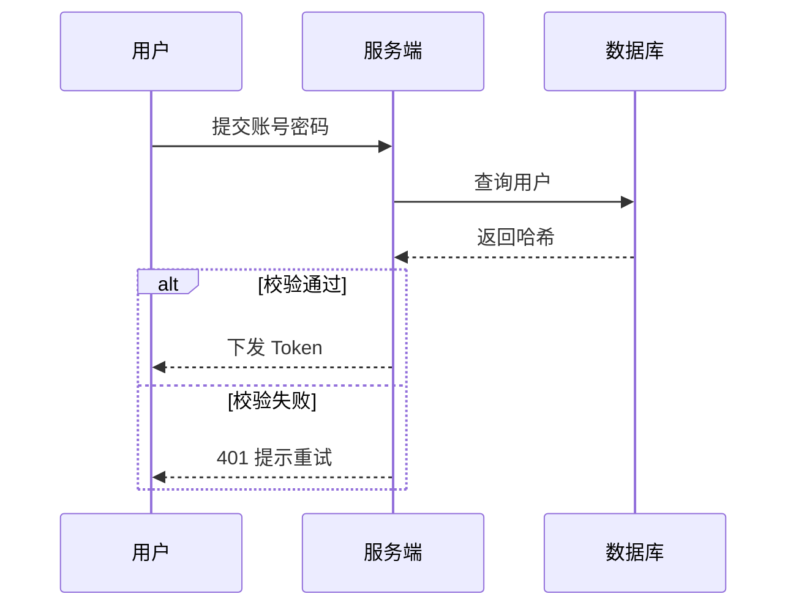

# Visualization（可视化）

把用户的"画个图"需求落地为可交付、可复用、可渲染的可视化产物：**图谱（diagram）**、**图表（chart）**、**表格（table）**、**可视化报告（report）**。核心方法论一句话：**先选对图，再画好图**——选型错误（用饼图看趋势）是最大的失败，装饰过度（3D/渐变/网格堆砌）是第二大失败。

## When to Use

- 用户要求绘制**图谱**：流程 / 时序 / 思维导图 / 架构 / 类 / 状态 / ER / 甘特 / 时间线；
- 用户给出数据要求做**图表**：柱状 / 折线 / 饼 / 散点 / 直方图 / 面积图等；
- 用户要求整理**表格**：把数据整理成对齐良好的 Markdown / CSV / HTML 表格；
- 用户要求生成**可视化报告 / 报表 / 周报 / Dashboard**：多图 + 表格 + 结论的组合；
- 用户说"把这个数据可视化 / 画个图 / 做个图谱 / 出个报告"。

## When NOT to Use

- 生成照片、插画、写实图像（那是**图像生成**，不是数据可视化）；
- 修图、抠图、图片风格迁移；
- 设计网页 / App 的 UI 布局与样式（那是前端工程）；
- 纯文字写作（不涉及任何图形或表格元素）。

## Workflow（四步：选型 → 生成 → 校验 → 输出）

### Step 1 — 选型（Identify & Advise）

> 机器可确定的判型交给脚本：`python3 scripts/viz_advisor.py "<用户需求>"`，输出推荐主类型（diagram/chart/table/report）、图表子类型与理由。
> 判型规则与设计原理详见 `references/chart-zh.md`。

1. 判断用户需求的**主类型**：
   - **diagram**：关系 / 流程 / 结构 / 时序 → 选 Mermaid 图种；
   - **chart**：有数值数据、要看趋势/对比/占比/分布 → 选图表子类型；
   - **table**：纯数据罗列、对照、清单 → 用表格；
   - **report**：多元素组合、面向汇报 → 用报告模板。
2. **chart 子类型选择**（决策树详见 chart-zh.md）：
   - 时间趋势 → `line`（折线）；分类对比 → `bar`（柱状）；占比构成 → `pie`/环形（≤6 类）；相关性 → `scatter`（散点）；分布 → `histogram`（直方图）；排名 → 横向 `bar`；多维度对比 → 分组/堆叠柱状。
   - **一张图只回答一个问题**；回答不了的拆成两张图。
3. 向用户**一句话说明选型理由**（除非用户只要结果不要解释）。不确定时给出 2 个备选并让用户选。

### Step 2 — 生成（Generate）

按类型执行。图种语法见 `references/mermaid-zh.md`；手写 SVG 规范见 `references/svg-zh.md`。

**diagram**：用 Mermaid 代码块输出。只允许下表图种，**不编造未验证的语法**：

| 图种 | 用途 |
|------|------|
| `flowchart` | 流程 / 算法 / 决策树 |
| `sequenceDiagram` | 时序交互（API 调用、登录流程） |
| `classDiagram` | 类与关系（OO 设计） |
| `stateDiagram-v2` | 状态机 / 生命周期 |
| `erDiagram` | 实体关系（数据库建模） |
| `gantt` | 甘特 / 项目排期 |
| `pie` | 占比（Mermaid 原生饼图） |
| `xychart-beta` | 折线 / 柱状（需 Mermaid ≥10.3，否则回退表格+解读） |
| `journey` | 用户旅程 |
| `mindmap` | 思维导图 / 主题发散 |
| `timeline` | 时间线 / 里程碑 |

**chart**：优先 Mermaid（`pie` / `xychart-beta`）；渲染器不支持 `xychart-beta` 时回退为**表格 + 文字解读**；需要精细样式时按 `references/svg-zh.md` 手写 SVG；**不承诺**生成真实位图图表（PNG/JPG）。

**table**：数据规整后跑脚本生成对齐良好的表格：

```bash
python3 scripts/table_builder.py --data '<JSON>' --title '<标题>' [--thousands] [--format md|csv|html]
```

**report**：把多张图 + 表格 + 文字结论组织成配置，跑脚本生成自包含 HTML 报告：

```bash
python3 scripts/report_builder.py <report.json> -o report.html
```

### Step 3 — 校验（Verify）

- **结构校验**：Mermaid 代码块闭合；节点 id 以字母开头；边/文本里的引号、括号已转义（`"`、`()`、`#`）；
- **渲染校验**：环境支持时渲染预览，出现"无法解析 / 语法错误"立即修复后重出；
- **数据校验**：数字未被错误格式化；表头与列数对齐；百分比合计 ≈ 100%；坐标轴有单位；
- **设计校验**：对照 chart-zh.md 清单——数据墨水比高、无装饰性 3D、无截断坐标轴、颜色 ≤7 种且有语义、图表带标题与结论。

### Step 4 — 输出（Output，见 Output Spec）

## Scene Modes（场景差异化）

- **PPT / 汇报**：图即论点，每张图配一句"结论句"；报告用 report_builder 生成打印友好 HTML；
- **研发 / 架构**：追求精确，ER / 类 / 时序图节点带关键字段与类型；避免装饰；
- **运营 / 数据分析**：突出趋势与异常，加标注（峰值 / 拐点 / 预警线 / 目标线）；
- **教学 / 文档**：图 + 文字双通道，图片带标题，表格带说明（caption）。

## Output Spec

- **diagram / chart**：输出可直接渲染的 Mermaid / SVG 代码块 + 一行"图注 / 结论"。SVG 需含 `viewBox`、可缩放、含 `<title>` 与 `<desc>`（无障碍）；
- **table**：Markdown 表格（含表头、对齐，必要时千分位与合计行）；用户要 CSV / HTML 时用脚本转换；
- **report**：自包含 HTML（内联样式、可离线打开、打印友好）；或按用户环境给 Markdown 版报告；
- **契约**：涉及数据给来源与口径；图表配"结论一句话"；**不得伪造数据或坐标**（不能为了好看截断坐标轴）；
- 用户要求导出文件时，写入 `.md` / `.html` / `.csv` 并给出路径。

## Failure Modes

- **选错图**：用饼图看趋势、用柱状做占比——先 `viz_advisor.py` 或按 chart-zh.md 决策树选型；
- **语法编造**：写了渲染器不认识的 Mermaid 图种/语法——只用上表图种，不确定先查 mermaid-zh.md；
- **装饰过度**：3D、阴影、渐变、背景网格堆砌，数据墨水比崩塌；
- **数字失真**：截断坐标轴、百分比不合计、单位缺失、颜色误导（红=好/绿=坏要统一）；
- **一次性硬编码**：把大数据写死在 SVG 里且不可维护——数据点 >20 先考虑表格或脚本生成；
- **跳过校验**：只输出不渲染、不检查语法，交付了打不开的图。

## Dependencies

- `python3`（可选）：`scripts/viz_advisor.py` / `table_builder.py` / `report_builder.py`，均**纯标准库**、离线可运行；
- 渲染预览需要支持 Mermaid 的环境（Trae / VS Code 插件 / mermaid.live 等）；无渲染环境时以**语法正确 + 结构自检**为验收标准。

## References

- Mermaid 图种与语法速查（含版本兼容注意）：[references/mermaid-zh.md](references/mermaid-zh.md)
- 图表选型决策树与设计原则（Tufte）：[references/chart-zh.md](references/chart-zh.md)
- 手写 SVG 规范与示例：[references/svg-zh.md](references/svg-zh.md)

## Examples

**输入**：`根据这组数据画个图：1月 120，2月 210，3月 95，4月 340`

**输出**：

```mermaid
xychart-beta
    title "月度访问量"
    x-axis [1月, 2月, 3月, 4月]
    y-axis "访问量" 0 --> 350
    line [120, 210, 95, 340]
```

> 结论：3 月回落、4 月创季度新高，折线图最能看出趋势。若渲染器不支持 xychart-beta，回退为下面这张表 + 一句解读。

**输入**：`画一个用户登录的时序图`

**输出**：



**输入**：`把这份数据做成表格：华东 1200、华南 2300、华北 3400`

**输出**：

| 区域 | 销量 |
|------|-----:|
| 华东 | 1,200 |
| 华南 | 2,300 |
| 华北 | 3,400 |

> 说明：数据列为数值，右对齐 + 千分位；添加一行合计可读性更好（用户要求时再加）。
