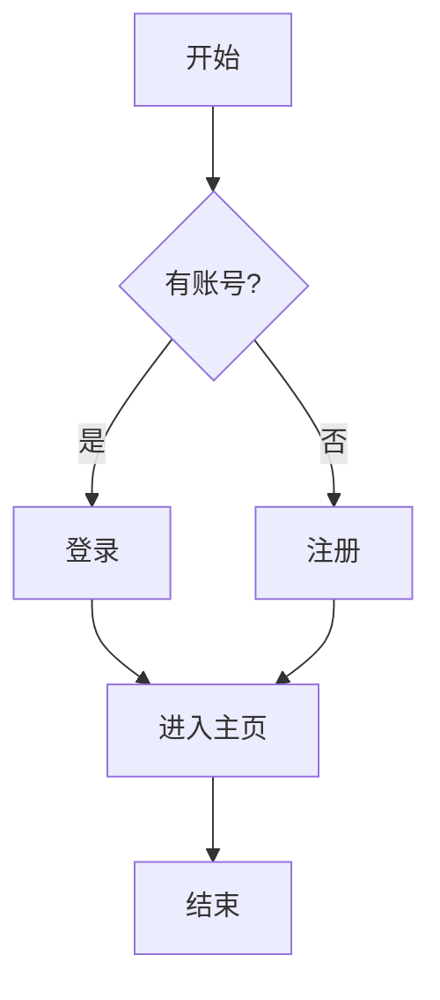
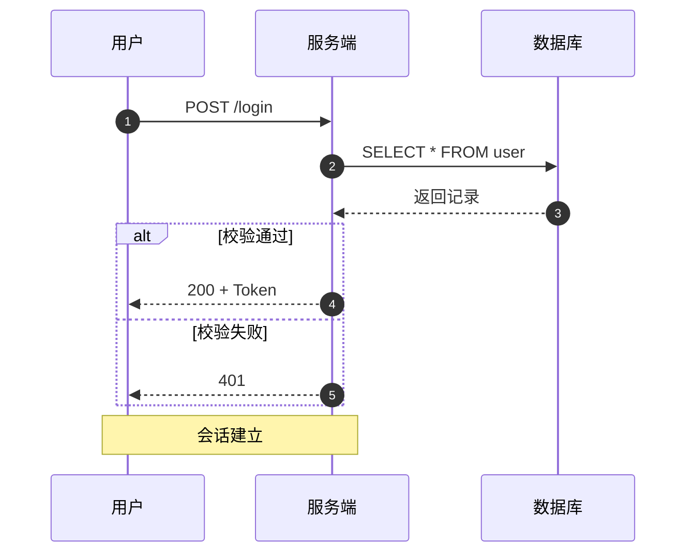
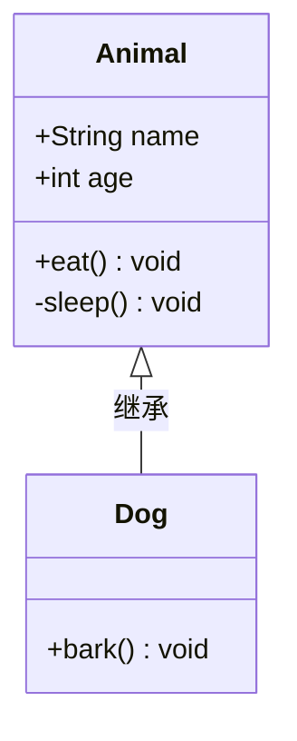
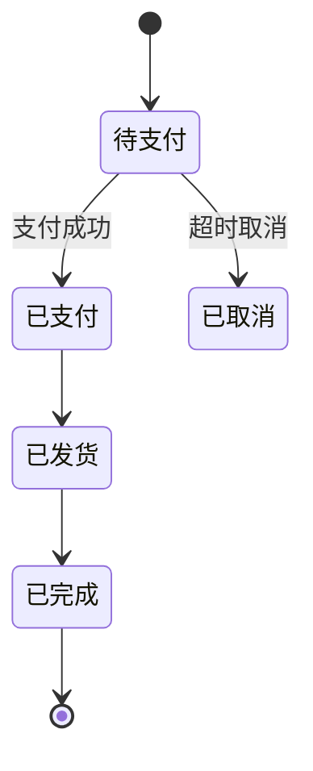
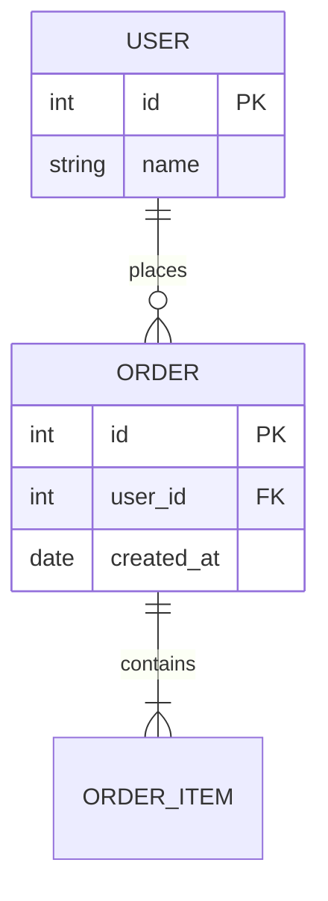
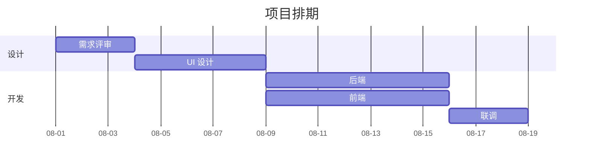
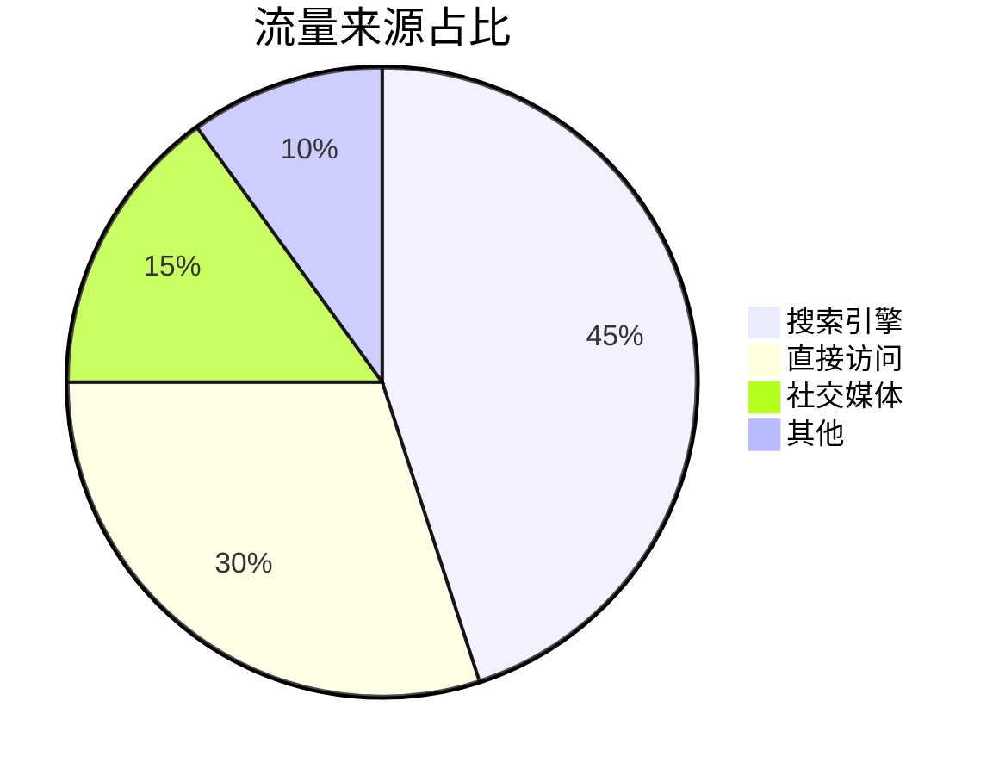
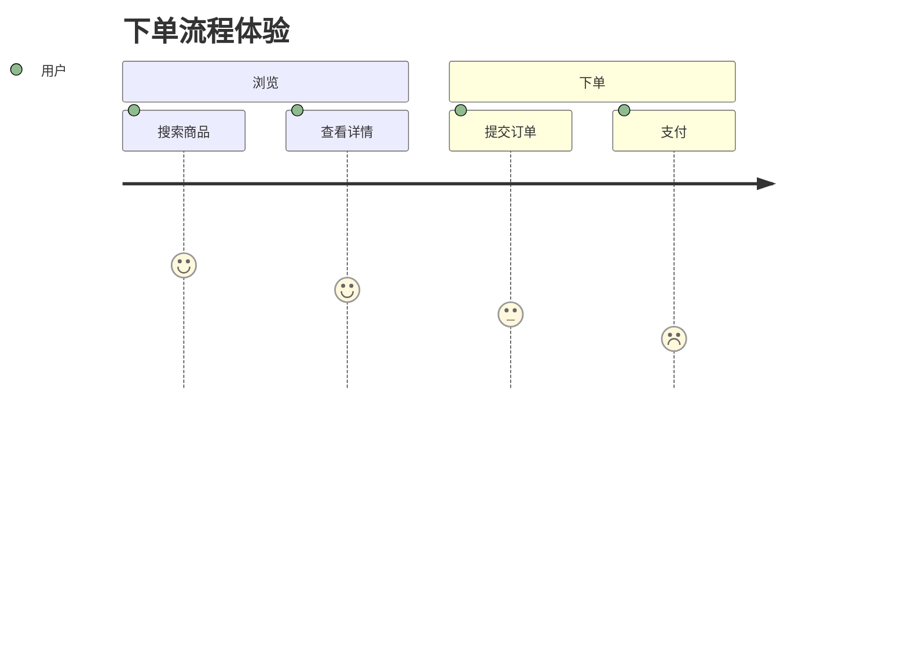
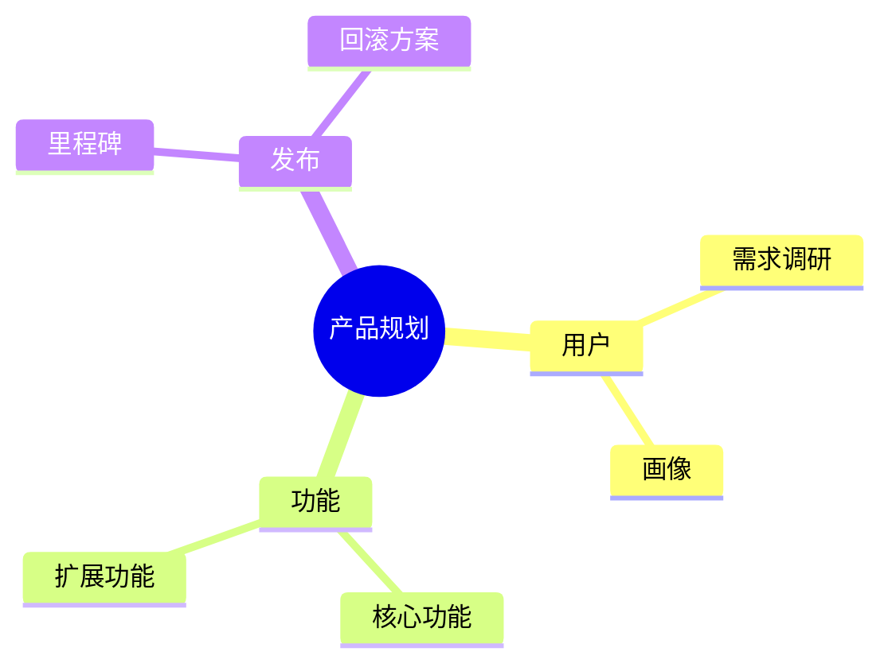
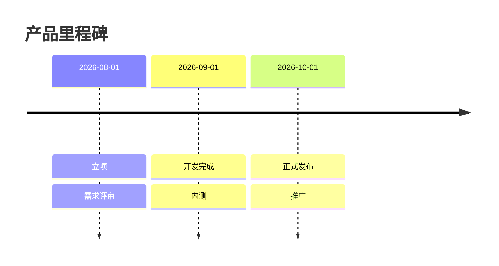

# Mermaid 图种与语法速查（中文）

> visualization 技能的唯一图谱语法源。**只使用本文档列出的图种与语法**，不编造未验证的写法。
> 官方文档：<https://mermaid.js.org/>。版本兼容：Mermaid **v10.3+** 才支持 `xychart-beta`；低版本渲染器会报错，此时回退为表格 + 文字解读。

---

## 0. 通用规范（所有图种）

- 代码块统一用：

```markdown
```mermaid
...图代码...
```
```

- **节点 id**：字母开头（`A`、`start`、`user_1`），不要用数字开头；同一图内 id 唯一；
- **文本转义**：节点文字含 `"`、`(`、`)`、`#`、`&` 时用双引号包裹或转义：
  - 错误：`A["read(file.txt)"]` 里的括号在 flowchart 下会解析失败 → 用 `A["read(file.txt)"]` 也需注意，稳妥写法：`A["read 文件"]` 或把括号写成中文括号；
  - 推荐：节点文字用中文括号（），避免英文括号冲突；
- **方向**：flowchart 用 `TB`（上到下，默认）、`LR`（左到右）、`RL`、`BT`；长流程用 `LR` 更省纵向空间；
- **注释**：`%% 注释`（图内）与 `<!-- 注释 -->`（图外）都不会被渲染，用于维护说明；
- **不要**在同一张图里塞超过 ~20 个节点；太多先分层，用 `subgraph` 分组。

---

## 1. flowchart（流程图）



常用节点形状：

| 语法 | 形状 | 用途 |
|------|------|------|
| `A[文字]` | 矩形 | 普通步骤 |
| `A(文字)` | 圆角矩形 | 普通步骤（可选） |
| `A{文字}` | 菱形 | 判断 / 分支 |
| `A([文字])` | 体育场形 | 开始 / 结束 |
| `A["文字"]` | 引号矩形 | 含特殊字符的文本 |
| `A[/文字/]` | 平行四边形 | 输入 / 输出 |
| `subgraph` | 分组框 | 模块边界 |

边样式：

```mermaid
flowchart LR
    A --> B       %% 有向
    A --- B       %% 无向
    A -.-> B      %% 虚线
    A ==> B       %% 粗线
    A -- 文字 --> B   %% 带标签
    A -->|文字| B     %% 带标签（等价）
    A --> B & C   %% 一分支多
```

---

## 2. sequenceDiagram（时序图）



- 参与者：`participant A as 别名`（也可 `actor`）；`autonumber` 自动编号；
- 消息线：`->` 实线、`-->` 虚线、`->>` 实线箭头、`-->>` 虚线箭头；
- 结构：`alt/else/end`（条件）、`opt`（可选）、`loop`（循环）、`par`（并行）、`Note over A,B`（注释）、`activate/deactivate`（生命线激活）。

---

## 3. classDiagram（类图）



- 可见性：`+` 公开、`-` 私有、`#` 保护、`~` 包内；
- 关系：`<|--` 继承、`*--` 组合、`o--` 聚合、`-->` 关联、`..>` 依赖；
- 泛型/接口用 `<<interface>>` 标注（`class X { <<interface>> }`）。

---

## 4. stateDiagram-v2（状态图）



- `[*]` 表示初始 / 终止伪状态；
- 复杂状态可嵌套 `state "名称" as S { ... }`；
- 分支用 `state fork_state <<fork>>` / `<<join>>`。

---

## 5. erDiagram（实体关系）



- 基数：`||--o{` 表示"1 对 0..N"；常用：`||` 恰好 1、`o{` 0..N、`|{` 1..N、`}o` 0..1；
- 字段用 `类型 字段名 标记`，标记 `PK` / `FK` / `UK`；
- 属性括号 `{ }` 内字段数量过多时拆成多张实体图。

---

## 6. gantt（甘特图）



- `section` 分组；任务 `id, 开始, 时长`；`after <id>` 表示依赖前序；
- 里程碑：`milestone : m1, 2026-08-20, 0d`。

---

## 7. pie（饼图）



- 只能展示**占比构成**，类别 ≤6 个；数据太多先合并"其他"；
- 不用于趋势 / 对比（见 chart-zh.md）。

---

## 8. xychart-beta（XY 图：折线 / 柱状）

```mermaid
xychart-beta
    title "月度销量"
    x-axis [1月, 2月, 3月, 4月]
    y-axis "销量" 0 --> 400
    line [120, 210, 95, 340]
```

- 折线用 `line [数值...]`；柱状用 `bar [数值...]`；可同时 `line` + `bar`；
- 多系列：`line [a,b] , line [c,d]`；
- **注意**：需 Mermaid ≥10.3；不支持的渲染器直接报错 → 回退为表格 + 解读，不要降级成编造的语法。

---

## 9. journey（用户旅程）



- 每行 `任务: 评分(1-5): 角色`；用于体验 / 满意度调研。

---

## 10. mindmap（思维导图）



- 缩进即层级；`((文字))` 圆形节点、`(文字)` 圆角、`[文字]` 矩形；
- 层级 ≤4 层，超过拆图。

---

## 11. timeline（时间线）



- 适合时间顺序事件；每段用 `日期 : 事件 : 备注`。

---

## 12. 排错速查

| 报错 / 现象 | 原因 | 修复 |
|------|------|------|
| 渲染器报 `unknown diagram type` | 用了不支持的图种 | 只使用本文档图种 |
| `xychart-beta` 空白 | 版本 <10.3 | 回退表格+解读 |
| flowchart 里括号报错 | 节点文字含英文括号 | 换中文括号或用 `A["..."]` |
| 中文乱码 | 字体/编码问题 | 确保文件 UTF-8，渲染环境支持 CJK |
| 图太长 | 节点过多 | 用 subgraph 分组或拆图 |

**产出前自检**：图种在本文档内 → 每个节点 id 字母开头且唯一 → 无未转义括号/引号 → 节点 ≤20 → 已做结构自检。
